```{r setup, include=FALSE}
knitr::opts_chunk$set(echo = TRUE, 
                      eval = FALSE)
```

# Basics

## Dependencies

You MUST have the following installed to participate:

> - R [https://www.r-project.org/](https://www.r-project.org/)

> - RStudio [https://www.rstudio.com/](https://www.rstudio.com/) <br><br> product -> Rstudio -> Desktop -> Open Source Edition<br>

> - the shiny package <br> `install.packages("shiny"); library("shiny")`

> - the ggplot2 package <br> `install.packages("ggplot2"); library("ggplot2")`

# What's the plan for today?

## Agenda

```{r}

try()

```

* Background
    - Example Use-Case: Diamonds
    - ui & server components
    - File & Directory instructions

<br>

* Your turn
    - Try building some apps: 9 Examples
    - Try the Example Use-Case
    - Replicate Chiin’s Explorer Tool

# Background

## Example Use-Case: Diamonds {#fullpageImages}

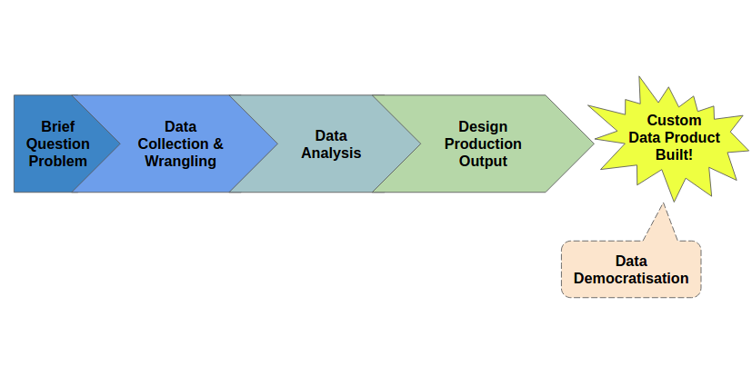

## Shiny App: ui & server components {#fullpageImages}

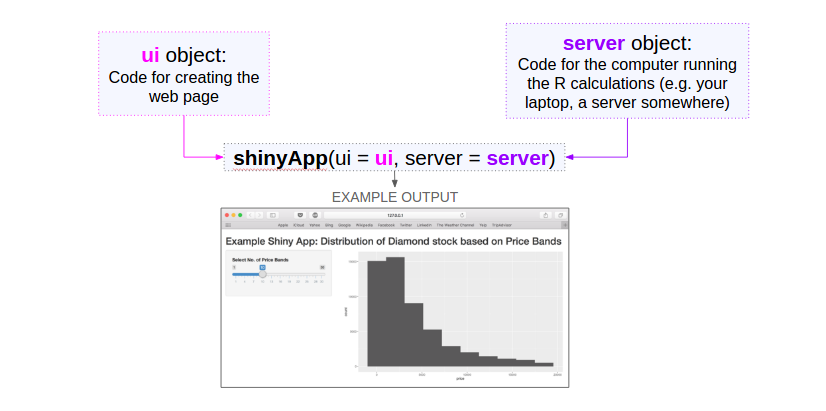

## Shiny App: File & Directory instructions {#fullpageImages}


# Your turn!

## Example 1: Empty app {.columns-2 #appImages}

Create a file "__app.R__" containing the following:
```{r app1}
  # Load the shiny package
  library(shiny)	

  # Define user interface
  ui <- basicPage()

  # Define server functionalities
  server <- function(input, output){}

  # Assemble app
  shinyApp(ui = ui, server = server)
```

<br>
Then click on 'Run App' 

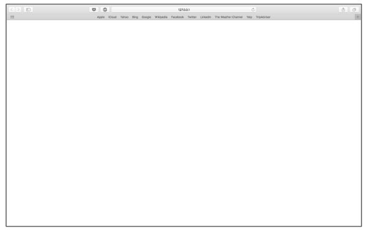

## Example 2: Basic ui Layout {.columns-2 #appImages}

```{r app2}
  # Load the shiny package
  library(shiny)	

  # Define user interface
  ui <- pageWithSidebar(
    titlePanel("Title"),
    sidebarPanel("Sidebar Panel"),
    mainPanel("Main Panel"))

  # Define server functionalities
  server <- function(input, output){}

  # Assemble app
  shinyApp(ui = ui, server = server)
```

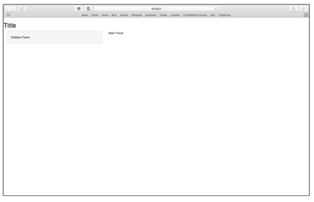

## Example 3: More basic ui Layout {.columns-2 #appImages}

```{r app3}
  # Load the shiny package
  library(shiny)	

  # Define user interface
  ui <- fluidPage(
    titlePanel("Title"),
    sidebarLayout(
      sidebarPanel("Sidebar Panel"),
      mainPanel("Main Panel")))

  # Define server functionalities
  server <- function(input, output){}

  # Assemble app
  shinyApp(ui = ui, server = server)
```

<br>


<span style = "color:orange; font-weight:bold"> Try resizing your browser and see how the layout changes! </span> 

## Example 4: ui with Input (slider) {.columns-2 #appImages}

```{r app4, out.width =  '500px'}
  # Load the shiny package
  library(shiny)	

  # Define user interface
  ui <- fluidPage(
    titlePanel("Title"),
    sidebarLayout(
      sidebarPanel("Sidebar Panel",
        sliderInput(
         inputId="bins",
         label="Slider Label",
         min=1, max=30, value=15)),
      mainPanel("Main Panel")))

  # Define server functionalities
  server <- function(input, output){}

  # Assemble app
  shinyApp(ui = ui, server = server)
```

<br><br><br>

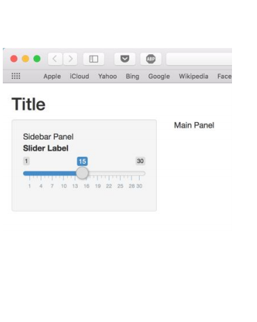

## Example 5: ui with Input (list select) {.columns-2 #appImages}

```{r app5}
  # Load the shiny package
  library(shiny)	

  # Define user interface
  ui <- fluidPage(
    titlePanel("Title"),
    sidebarLayout(
      sidebarPanel("Sidebar Panel",
              selectInput(
               inputId="list",
               label="List Label",
               choices=c("Fair",
                         "Good",
                         "Very Good"),
               selected="Good")),
      mainPanel("Main Panel")))

  # Define server functionalities
  server <- function(input, output){}

  # Assemble app
  shinyApp(ui = ui, server = server)
```

<br><br><br><br><br>

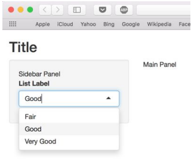

## Example 6: Tab ui with an Output (plot) {.columns-2 #appImages}

```{r app6}
  # Load the shiny package
  library(shiny)	

  # Define user interface
  ui <- fluidPage(
    titlePanel("Title"),
    sidebarLayout(
      sidebarPanel("Sidebar Panel"),
      mainPanel("Main Panel",
        tabsetPanel(
          tabPanel(title="1st Plot", 
            plotOutput(
              outputId = "plot1"
              )
            ),
          tabPanel(title = "2nd Plot", 
            plotOutput(
             outputId = "plot2"))))))
  
  # Define server functionalities
  server <- function(input, output){}

  # Assemble app
  shinyApp(ui = ui, server = server)
```

<br><br><br><br><br><br><br>

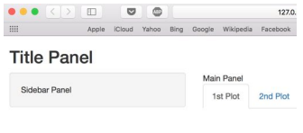

## Example 7: Tab ui rendering 1 Output

```{r app7}
  # Load the shiny package
  library(shiny)
  library(ggplot2)

  # Define user interface
  ui <- fluidPage(
    titlePanel("Title"),
    sidebarLayout(
      sidebarPanel("Sidebar Panel"),
      mainPanel("Main Panel",
        tabsetPanel(
          tabPanel(title="1st Plot", plotOutput(outputId = "plot1")),
          tabPanel(title = "2nd Plot", plotOutput(outputId = "plot2")))
        )))
  
  # Define server functionalities
  server <- function(input, output){
    output$plot1 <- renderPlot({
      ggplot(data=diamonds, aes(x=price)) +
        geom_histogram()
      })}

  # Assemble app
  shinyApp(ui = ui, server = server)
```

## Example 7: Tab ui rendering 1 Output {#fullpageImages}

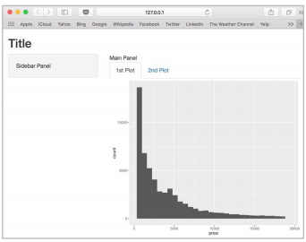

## Example 8: Tab ui rendering 2 Outputs

```{r app8}
  # Load packages
  library(shiny)
  library(ggplot2)

  # Define user interface
  ui <- fluidPage(
    titlePanel("Title"), 
    sidebarLayout(sidebarPanel("Sidebar Panel"), mainPanel("Main Panel",
                  tabsetPanel(
                    tabPanel(title="1st Plot", plotOutput(outputId = "plot1")),
                    tabPanel(title = "2nd Plot", plotOutput(outputId = "plot2"))))))
  
  # Define server functionalities
  server <- function(input, output){
    output$plot1 <- renderPlot({
      ggplot(data=diamonds, aes(x=price)) + geom_histogram()})
    output$plot2 <- renderPlot({
      ggplot(data=diamonds, aes(x=carat)) + geom_histogram()}) } 

  # Assemble app
  shinyApp(ui = ui, server = server)
```

## Example 8: Tab ui rendering 2 Outputs {#fullpageImages}

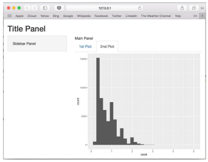

## Example 9: Reactive ui, single I-O

```{r app9}
  # Load packages
  library(shiny)
  library(ggplot2)

  # Define user interface
  ui <- fluidPage(
    titlePanel("Title"),
    sidebarLayout(
      sidebarPanel("Sidebar Panel",
                   selectInput(inputId="list", label="List Label",
                               choices=c("price", "carat"), selected="price")), 
      mainPanel("Main Panel",
                tabsetPanel(tabPanel(title="1st Plot", 
                                     plotOutput(outputId = "plot1"))))))
  
  # Define server functionalities
  server <- function(input, output){
    output$plot1 <- renderPlot({
      ggplot(data=diamonds, aes_string(x=input$list)) + geom_histogram()})} 

  # Assemble app
  shinyApp(ui = ui, server = server)
```

## Example 9: Reactive ui, single I-O (list select \& plot) {#fullpageImages}

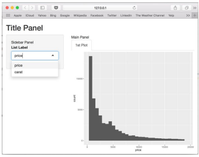

## Now Try the Example Use-Case {#fullpageImages}

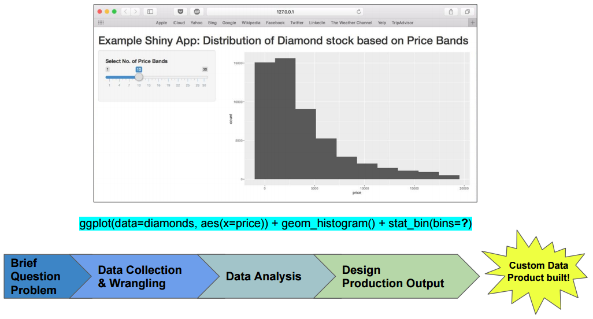

## Now Try the Example Use-Case: CODE

```{r usecase}
  library(shiny)
  library(ggplot2)

  ui <- fluidPage(
    titlePanel("Example Shiny App: Distribution of Diamond stock by Price Bands"),
    sidebarLayout(
      sidebarPanel(
        sliderInput(inputId="bands",
                    label="Select No. of Price Bands",
                    min=1,
                    max=30,
                    value=15)),
      mainPanel(plotOutput(outputId="plot"))))
  
  server <- function(input, output){
    output$plot <- renderPlot({
      ggplot(data=diamonds, aes(x=price)) + 
        geom_histogram() + stat_bin(bins=input$bands)})}
  
  shinyApp(ui=ui, server=server)
```

## Replicate Chiin's Explorer Tool {#notfullpageImages}

You can deploy a limited no./usage of your apps for free on shinyapps.io
(like I've done here to demonstrate), which is a freemium hosted version of Shiny Server.

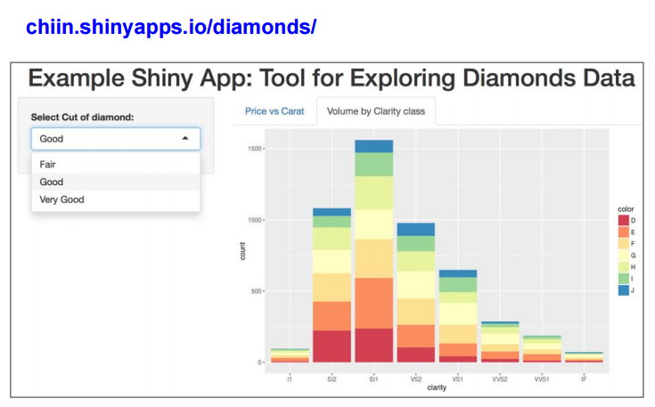

## Replicate Chiin's Explorer Tool: CODE (part 1 of 2)

```{r explorertool}
  library(shiny)
  library(ggplot2)
  library(RColorBrewer)

  ui <- fluidPage(
    titlePanel("Example Shiny App: Tool for Exploring Diamond Data"),
    sidebarLayout(sidebarPanel(
      selectInput(inputId = "cut", label = "Select Cut of Diamond:",
                  choices = c("Fair", "Good", "Very Good"), selected = "Good")),
      mainPanel(tabsetPanel(tabPanel("Price vs Carat",
                                     plotOutput(outputId = "scatter")),
                            tabPanel("Volume by Clarity class",
                                     plotOutput(outputId = "bar"))))))
  
```

## Replicate Chiin's Explorer Tool: CODE (part 2 of 2)

```{r explorertool2}
  server <- function(input, output){
    getDataset <- reactive({
      if (input$cut=="Fair") {
        return(diamonds[diamonds$cut=="Fair", ])
        } else if (input$cut=="Good") {
          return(diamonds[diamonds$cut=="Good", ])
          } else {
            return(diamonds[diamonds$cut=="Very Good", ])
            }})
    
    output$scatter <- renderPlot({
      ggplot(data=getDataset(), aes(x=price, y=carat)) +
        geom_point(aes(colour=color)) + scale_color_brewer(palette="Blues")})
    
    output$bar <- renderPlot({
      ggplot(data=getDataset(), aes(x=clarity)) + 
        geom_bar(aes(fill=color)) + scale_fill_brewer(palette="Spectral")})}
  
  shinyApp(ui=ui, server=server)
```

## 

<span style = "color:orange; font-weight:bold"> Remember there's more than one way to skin a cat!! (i.e. as with all things in R, there's multiple code to achieve the same outcome, so go with whatever code works best for you! </span>

Recommended resources:

- Official site for gallery, tutorials & articles: [shiny.rstudio.com](shiny.rstudio.com)
- From UBC STAT 545 course: [deanattali.com/blog/building-shiny-apps-tutorial](deanattali.com/blog/building-shiny-apps-tutorial)
 & associated slides
- Blog: [https://goo.gl/BZIZfC](zevross.com/blog/2016/04/19/r-powered-web-applications-with-shiny-a-tutorial-and-cheat-sheet-with-40-example-apps)
- For specific questions: [Stack Overflow](http://stackoverflow.com/)!

<span style = "color:red"> For access to the slides & scripts email rladieslondon@gmail.com with your request & your full name! (which you’ll already have done if you’re reading this now!) </span>
