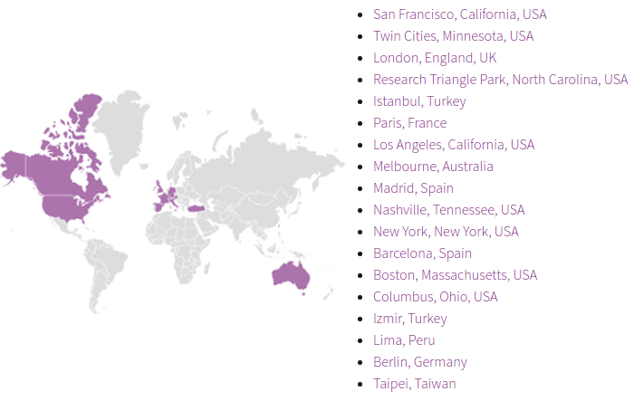

```{r setup, include=FALSE}
knitr::opts_chunk$set(echo = TRUE, 
                      eval = TRUE)
```

## What's R-ladies?

R-ladies is a world-wide organization to promote gender diversity in the R community.



<!--- ToDo ## Who's R-ladies London team?
Add photos and names -->

## What's R?

In origin was __S__, a programming language for statistical computing and interactive graphics. It was developed by John Chambers, Rick Becker and Allan Wilks of (NOKIA) Bell Laboratories in 1976. 

<!--- At that time statistical computing was done by directly calling Fortran subroutines; however, S was designed to offer an alternate and more interactive approach. -->

S went through many version updates (1-4, 5 plus...) until in 1992 Ross Ihaka and Robert Gentleman (University of Auckland, New Zealand) worked on a further implementation and renamed it __R__.

 

<!--- There are some differences (e.g. in S y_2 is equal to y=2, in R y_2 is just a string/object), but much of the code written for S runs unaltered in R. -->

R is currently developed by the __R Development Core Team__, of which Chambers is a member. It is a Free Software, available under a GNU General Public License. It compiles and runs on a wide variety of platforms (including Linux, Windows and MacOS).

<!--- The project was conceived in 1992, with an initial version released in 1995 and a stable beta version in 2000. -->

_(Wikipedia)_


# Let's install the software


## Install R

Go to the R-project website, download and install R: 

[https://www.r-project.org/](https://www.r-project.org/)

The default Graphical User Interface (GUI) is basically a console!

 


## Using the prompt/console

To start R from command line, type __R__ then hit enter (ONLY FOR LINUX/MAC USERS!).

When R is waiting for us to tell it what to do, it begins the line with the symbol:

__>__

If we give it an incomplete command and it can not finish the task requested it provides:

__+__

To get out of R we use the command

__q()__ 


# Your turn!

## Try the basic GUI (console)

> - Open an R instance

> - Top line in the opening message: __R version number (release date) and name__

> - Try the functions __license()__, __help()__ and __q()__ 

> - __For complex operations you might need to have an editor, check your environmental variables, visualise plots without switching windows... that's why we recommend to use RStudio!__ 

<!--- Show where to find R version number and name, basic instructions. Point out limitations of using an R console vs an IDE like RStudio. Ctrl-L to clear the console. -->

## Install RStudio

RStudio is an Integrated Development Environment (IDE) specifically designed for the R language.

On the RStudio website ([https://www.rstudio.com/](https://www.rstudio.com/)) 

go to __product -> Rstudio -> Desktop -> Open Source Edition__

download and install RStudio Open Source Edition:


## Basic operations, like a calculator

R can be used as a calculator. 

You can enter an expression to evaluate and hit enter (if you use the command line) or click the Run button (if you use Rstudio) to compute the result.

- Use __\*__ for multiply.

- Use __^__ for raised to the power of.

- Use __parentheses__ to ensure that it understands what you are trying to compute.

- The order of doing arithmetic operations is (left [done first] to right [done last]): __^ / * - +__

# Your turn!

## Basic operations, like a calculator

```{r}
1 + 2 
5 * 6 + 9 * (10 ^ (-2) + 2 * 3)
```

## Literal operations

Like in algebra, we may want to store a computation under some variable name. The result is assigned to a variable with the __<-__ ('less than' symbol followed by a hyphen):

```{r}
a <- 1
```

- When you want to know what is in a variable simply ask by typing the variable name.

```{r}
a
```

- We can store a computation under a new variable name or change the current value in an old variable.

```{r}
b <- 2
b <- exp(b)
```

## Something to remember

- Certain variable names are reserved for particular purposes (e.g. c q t C D F I T)

- Do not begin a variable name with a period or a number. 

- Variable names are case (upper/lower) sensitive.

## Data types and objects

R supports 5 basic data types: 

- integer, 
- numeric, 
- character, 
- logical and 
- complex.

Missing values are labelled: __NA__. 

Elements of basic type can be combined to form complex data objects such as:

- vectors, 
- matrices, 
- arrays, 
- data frames and 
- lists.

## Objects

A __vector__ is a sequence of data elements of the same basic type. To create a vector we can concatenate a list of elements using the function __c()__.

A __matrix__ is a 2 dimensional table in which every element is of the same type. To create a matrix we use the function __matrix()__.

An __array__ is similar to a matrix but can have more than 2 dimensions. To create an array we use the function __array()__.

A matrix in which each column can be of a different type is called __data frame__ and can be created using the function __data.frame()__.

A __list__ is like a data frame but each column can be of different length or even a tree of data objects. A list is generated using the function __list()__.

# Your turn!

## Let's experiment with data objects

```{r}
a   <- 1                                                   # single variable

v1  <- c(1,2,3)                                            # vector
# Get the length of a vector
length(v1)

m1  <- matrix(0, nrow = 3, ncol = 2)                       # matrix
# Count dimensions
dim(m1)

df1 <- data.frame(v1, v1 * 10)                             # data frame

l1  <- list("a" = a, "v1" = v1, "m1" = m1, "df1" = df1)    # list
# What would you use to count the elements of a list?
```

## Explore data objects

```{r}
typeof(l1)
str(l1)
```

## Extract elements from data objects

Data objects in R are indexed. These indices can be used to extract/subset vectors, matrices, data frames and lists. Alternatively, named dimensions can be extracted using the operator __$__

```{r, eval=FALSE}
v1[2]             # extract the second element of vector v1
l1[2]             # extract the second element of list l1
m1[3,2]           # extract the element in the third row second column of m1 
df1[3,2]          # extract the element in the third row second column of df1 
```

```{r}
l1$v1
```

## R Base + core packages
All the basic R functions and operators seen so far are automatically loaded under the __R Base Package__ (base).

There are additional built-in functions that are loaded grouped in separated packages. Each package is used for a specific purpose. 

Some examples are: __base__, __stats__, __graphics__, __datasets__, etc.

## Built-in functions

```{r, eval=FALSE}
x <- c(1,2,3,4,5,6,7,8,9)

# Core functions from the "base" package
print("Hello world!")   # Print messages
sum(x)      # calculates the sum of the elements in the vector x
mean(v1)    # average
max(x)      # the largest value
min(x)      # the smallest value
log(b)      # natural logarithm (log10 computes logarith with base 10)
sort(x)     # re-arrange elements of x in ascending order
summary(v1) # summary statistics

# Core functions from the "stats" package
median(x)   # the sample median
var(x)      # the sample variance (has n-1 in denominator)
sd(x)       # the standard deviation
```

## NAMESPACE

```{r, eval=FALSE}
stats::cov
cov
```

## But... be careful!
```{r, eval=FALSE}
cov <- function(x){x+1}
cov
stats::cov              # the original cov function is not lost!
rm(cov)                 # remove the last definition
```


## Setting your working directory

Check where your working directory is- this is the location where all files and functions will be read and written to

```{r}
getwd()
```

If this isn't where your files are then you can set it through (put your own path in the quotes!)

```{r eval=FALSE} 
setwd("C:\Documents\mypath") 
```

Or in Rstudio you can go to: Session > Set Working Directory > Choose Directory and navigate to your folder


## Example data

R comes with a number of example datasets. To browse the complete list use the function __data()__, with no inputs. 

<div class="columns-2">
  

  For example, the __iris__ dataset consists of 50 samples from three species of Iris (Iris setosa, Iris virginica and Iris versicolor). Four features were measured from each sample: the length and the width of the sepals and petals, in centimetres.
</div>

```{r}
head(iris)
```


## Look at the in-built data set on trees

```{r}
trees
```

## Explore the trees data set

The top of the data 
```{r, eval=FALSE} 
head(trees)
```

The end of the data set 
```{r, eval=FALSE} 
tail(trees) 
```

The size and type of the data 
```{r, eval=FALSE} 
str(trees) 
```

Summary statistics on each of the fields 
```{r, eval=FALSE} 
summary(trees) 
```

Pull out only one of the fields 
```{r, eval=FALSE} 
summary(trees$Girth) 
```

## Basic plots

Create your first plot
```{r, eval=TRUE}
boxplot(trees)
```

## Basic plots

Create another variable with only one of the fields and plot that
```{r, eval=TRUE, fig.height=4}
boxplot(trees$Girth, xlab="Girth (units)", title="Tree Girths")
```

## Export/Import a table (data.frame) to/from text file

```{r}
write.csv(iris,"~/iris.csv")

myTable <- read.csv("~/iris.csv")

head(myTable)
```


## Work with remote files

```{r}
myTable2 <- read.csv("http://www.ats.ucla.edu/stat/data/hsb2.csv")

head(myTable2)
```


## R data formats

Rds stores a single R object, use readRDS() and saveRDS() to read in and save respectively.

```{r, eval=FALSE}
## save a single object to file
pippo <- c(1,2,4)
saveRDS(pippo, "pippo.rds")

## restore it under a different name
pippo2 <- readRDS("pippo.rds")
```

RData (or rda) allows to save(), load(), attach() multiple data objects in one file.

```{r, eval=FALSE}
## save two objects to one file
pippo <- c(1,2,4)
pluto <- c(3,5,4)
save(pippo, pluto, file= "x.rda")

## restore the objects
load("x.rda")
```


## Other data formats

There are dedicated R packages to handle the most commonly used data formats.

<br>

Some examples are:

* Text files (e.g. csv)

* Spreadsheets (e.g. .xls)

* GIS files (e.g. .shp, ascii, .tif)

* Binaries (e.g. .nc)

* Markups (e.g. xml, gml)

<br>

R can also connect to databases (e.g. postgresql).


## Install additional packages

There are ~8000 R packages available on the Comprehensive R Archive Network (CRAN). 

```{r, eval = FALSE}
# Install a new package for advanced graphics
install.packages("ggplot2")

# Load the package
library("ggplot2")
```

## Custom functions

You can create a custom function as in the example below:

```{r}
myFunction <- function(x){
   
   y <- x + 1
   
   return(y)
}

myFunction( x = 32 )
```


## Help

Each function comes with a documentation page that can be visualised typing __help(*name of the function*)__ in the console. Alternatively, you can type __?__ (question mark) before the name of the function.

```{r, eval=FALSE}
help(print)
?print
```

You can also:

* Browse [Rseek](http://rseek.org/) to find out which packages are available for a given topic (e.g., cluster analysis)

* Join the [R users forum](http://r.789695.n4.nabble.com/)

* [Google your problem](http://www.google.com/)

* Post a question on [stack overflow](http://stackoverflow.com/)


## Cheat Sheets & Reference Guides

* [R Reference Card](http://cran.r-project.org/doc/contrib/Short-refcard.pdf)

* [Writing R extensions](http://bit.ly/1H0U02a)

* [Google's R Style Guide](https://google.github.io/styleguide/Rguide.xml)

* RStudio website
    - [Data Visualization](http://bit.ly/1Foy1Lb)
    - [Package Development](http://bit.ly/1CfbTD2)
    - [Data Wrangling](http://bit.ly/1y2nh3f)
    - [R Markdown](http://bit.ly/1BluuT5)
    - [R Markdown Reference Guide](http://bit.ly/1L2tC7U)
    - [Shiny](http://bit.ly/1GiGArG)

## Where to go next

Great tutorials:

- edx MiT course: https://www.edx.org/course/analytics-edge-mitx-15-071x-2
- DataCamp: https://www.datacamp.com/
- Coursera: https://www.coursera.org/learn/r-programming
- Great Kaggle Tutorials: https://www.kaggle.com/mrisdal/titanic/exploring-survival-on-the-titanic

