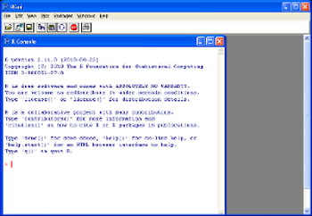
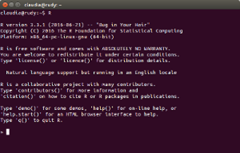
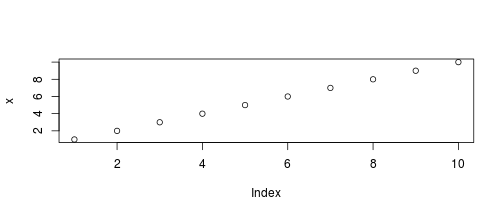
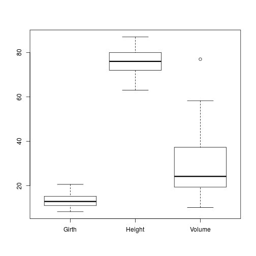
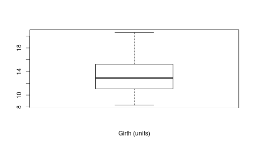

## What's R?

In origin was __S__, a programming language for statistical computing and interactive graphics. It was developed by John Chambers, Rick Becker and Allan Wilks of (NOKIA) Bell Laboratories in 1976. 

<!--- At that time statistical computing was done by directly calling Fortran subroutines; however, S was designed to offer an alternate and more interactive approach. -->

S went through many version updates (1-4, 5 plus...) until in 1992 Ross Ihaka and Robert Gentleman (University of Auckland, New Zealand) worked on a further implementation and renamed it __R__.

 

<!--- There are some differences (e.g. in S y_2 is equal to y=2, in R y_2 is just a string/object), but much of the code written for S runs unaltered in R. -->

R is currently developed by the __R Development Core Team__, of which Chambers is a member. It is a Free Software, available under a GNU General Public License. It compiles and runs on a wide variety of platforms (including Linux, Windows and MacOS).

<!--- The project was conceived in 1992, with an initial version released in 1995 and a stable beta version in 2000. -->

_(Wikipedia)_

# Let's install the software

## Install R

Go to the R-project website, download and install R: 

[https://www.r-project.org/](https://www.r-project.org/)

The default Graphical User Interface (GUI) is basically a console!

 


## Your turn!

> - Open an R instance
> - Top line in the opening message: __R version number (release date) and name__
> - Try the functions __license()__, __help()__ and __q()__ 
> - Use R as a basic calculator (+ - / \*): 2 \* 3 
> - You can assign a value to a variable using either __<-__ or __=__
> - Define variable 'a' equal to 1: a <- 1
> - Define variable 'b' equal to 3 and calculate 'a+b': b <- 3; a+b
> - Note the semicolon (;) is used to concatenate multiple operations in one line.
> - __Let's face it, using R from console is not very appealing! For complex operations you need to have an editor, check your environmental variables, visualise plots without switching window...that's why we use RStudio!__ 

<!--- Show where to find R version number and name, basic instructions. Point out limitations of using an R console vs an IDE like RStudio. Ctrl-L to clear the console. -->

## Install RStudio

RStudio is an Integrated Development Environment (IDE) specifically designed for the R language.

Go to the RStudio website, download and install R: 

RStudio [https://www.rstudio.com/](https://www.rstudio.com/) <br><br> product -> Rstudio -> Desktop -> Open Source Edition<br>


## Pre-installed packages

The basic R installation comes with a number of pre-installed packages (e.g. base, graphics, stats...). A package is a container of functions, for instance the functions c() and mean() are in the __base__ package, plot() is in the __graphics__ package, ect.


```r
x <- c(1, 2, 3, 4, 5, 6, 7, 8, 9, 10)
mean(x)
```

```
## [1] 5.5
```

```r
plot(x)
```



## Install additional packages

There are ~8000 R packages available on the Comprehensive R Archive Network (CRAN). 


```r
# Install a new package for advanced graphics
install.packages("ggplot2")

# Load the package
library("ggplot2")
```

## Where to find help:
  
* R package documentation, here is how to get to the in-built help pages

```r
?boxplot 
```

* Browse [Rseek](http://rseek.org/) to find out what packages are available for a given topic (e.g. cluster analysis)

* Join the [R users forum](http://r.789695.n4.nabble.com/)

* [Google your problem](http://www.google.com/)

* [Stackoverflow](http://stackoverflow.com/)

## Setting your working directory

Check where your working directory is- this is the location where all files and functions will be read and written to


```r
getwd()
```

If this isn't where your files are then you can set it through (put your own path in the quotes!)


```r
setwd("C:\Documents\mypath") 
```

Or in Rstudio you can go: Session>Set Working Directory>Choose Directory and navigate to your folder

## Load & explore a dataset

Have a look at the in-built data sets in R

```r
data()
```

## Look at the in-built data set on trees


```r
trees
```

```
##    Girth Height Volume
## 1    8.3     70   10.3
## 2    8.6     65   10.3
## 3    8.8     63   10.2
## 4   10.5     72   16.4
## 5   10.7     81   18.8
## 6   10.8     83   19.7
## 7   11.0     66   15.6
## 8   11.0     75   18.2
## 9   11.1     80   22.6
## 10  11.2     75   19.9
## 11  11.3     79   24.2
## 12  11.4     76   21.0
## 13  11.4     76   21.4
## 14  11.7     69   21.3
## 15  12.0     75   19.1
## 16  12.9     74   22.2
## 17  12.9     85   33.8
## 18  13.3     86   27.4
## 19  13.7     71   25.7
## 20  13.8     64   24.9
## 21  14.0     78   34.5
## 22  14.2     80   31.7
## 23  14.5     74   36.3
## 24  16.0     72   38.3
## 25  16.3     77   42.6
## 26  17.3     81   55.4
## 27  17.5     82   55.7
## 28  17.9     80   58.3
## 29  18.0     80   51.5
## 30  18.0     80   51.0
## 31  20.6     87   77.0
```

## Explore the trees data set

The top of the data 

```r
head(trees)
```

The end of the data set 

```r
tail(trees) 
```

The size and type of the data 

```r
str(trees) 
```

Summary statistics on each of the fields 

```r
summary(trees) 
```

Pull out only one of the fields 

```r
summary(trees$Girth) 
```

## Basic plots

Create your first plot

```r
boxplot(trees)
```



## Basic plots

Create another variable with only one of the fields and plot that

```r
treeGirth <- trees$Girth
boxplot(treeGirth, xlab="Girth (units)", title="Tree Girths")
```



## Import data from a csv file

It would be best if you can get your own data and start exploring that.
Make sure that your working directory is set to your file's location

```r
data <- read.csv("myfile.csv")
```

## Cheat Sheets & Reference Guides

* [R Reference Card](http://cran.r-project.org/doc/contrib/Short-refcard.pdf)

* [Writing R extensions](http://bit.ly/1H0U02a)

* [Google's R Style Guide](http://google-styleguide.googlecode.com/svn/trunk/Rguide.xml)

* RStudio website
    - [Data Visualization](http://bit.ly/1Foy1Lb)
    - [Package Development](http://bit.ly/1CfbTD2)
    - [Data Wrangling](http://bit.ly/1y2nh3f)
    - [R Markdown](http://bit.ly/1BluuT5)
    - [R Markdown Reference Guide](http://bit.ly/1L2tC7U)
    - [Shiny](http://bit.ly/1GiGArG)

## Where to go next

Great tutorials:

- edx MiT course: https://www.edx.org/course/analytics-edge-mitx-15-071x-2
- DataCamp: https://www.datacamp.com/
- Coursera: https://www.coursera.org/learn/r-programming
- Great Kaggle Tutorials: https://www.kaggle.com/mrisdal/titanic/exploring-survival-on-the-titanic

