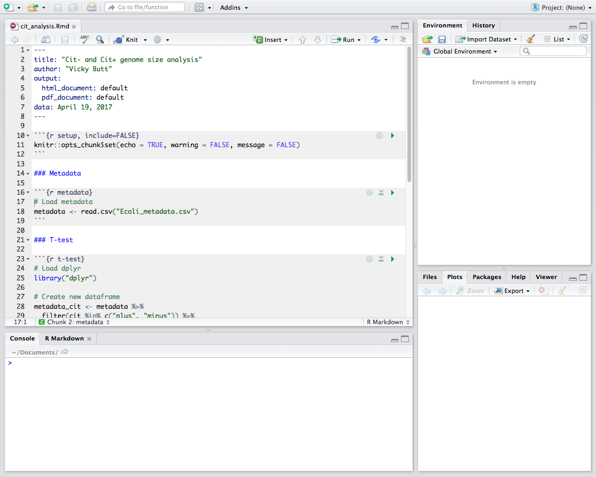
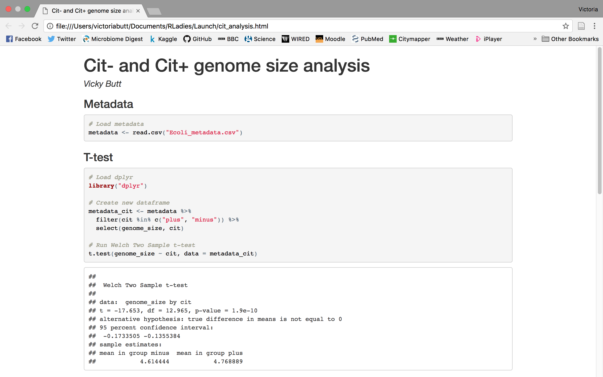

```{r setup, include=FALSE}
knitr::opts_chunk$set(echo = TRUE)
```

## Objectives

- Introduction to RStudio
- Data frames
- Manipulating metadata with ‘dplyr’ package
- Test model: T-test to find difference in genome size between Cit- and
Cit+
- Introduction to ‘ggplot2’ package
- Visualise: Using ‘ggplot2’ to show genome size for Cit-, Cit+ and
unknown
- Report: Summarising results in R Markdown
  
## Download the metadata

- Create a folder for this workshop e.g. “Rladies_research_workshop” in Documents
- Go to: https://github.com/datacarpentry/R-genomics/blob/gh-pages/data/Ecoli_metadata.csv Right click “Raw” and “Save Link As” to your workshop folder. (make sure it’s named Ecoli_metadata)
  
## Getting started with RStudio

- Create a new script and save to workshop folder
- Set your working directory to the workshop folder in your script:

```{r eval=FALSE}
setwd("~/Documents/RLadies_research_workshop")
```

## Getting started with the data

In your script:

```{r}
# Load metadata
metadata <- read.csv("data/Ecoli_metadata.csv")
```

In the console:

```{r eval=FALSE}
# What type of object is metadata?
class(metadata)

# View the top (first 6 lines) of metadata
head(metadata)

# Summary. How many samples are there?
str(metadata)
```

## Data frames

```{r eval=FALSE}
# Dimensions of metadata
dim(metadata)

# Extract first element in the 2nd column
metadata[1,2]

# Extract 3rd column
metadata[,3]

# Extract first 6 rows
metadata[1:6,]
```

## Data frames

```{r eval=FALSE}
# Extract column by name
metadata$strain

# Extract more than one column by name
metadata[,c("strain", "clade")]

# Extract rows 4 to 7 of column names
metadata[4:7, c("strain", "clade")]
```

## "dplyr" package for manipulating data

```{r eval=FALSE}
# Install dplyr
install.packages("dplyr")
```

In your script:

```{r, message=FALSE}
# Load dplyr (remember to run!)
library("dplyr")
```

## "select" and "filter" functions

```{r eval=FALSE}
# Select sample, clade, cit and genome_size columns
select(metadata, sample, clade, cit, genome_size)

# Filter rows where cit column equal to "plus"
filter(metadata, cit == "plus")
```

## Pipes in "dplyr"

```{r eval=FALSE}
# Filter rows where cit column equals "plus",
# then select sample, generation and clade columns 
metadata %>%
  filter(cit == "plus") %>% 
  select(sample, generation, clade)

# Assign to a new name
# Filter rows where cit column equals "plus" or "minus", 
# then select sample, generation and clade columns 
meta_citplus <- metadata %>%
  filter(cit %in% c("plus", "minus")) %>% 
  select(sample, generation, clade)

meta_citplus
```

## "mutate" function

```{r eval=FALSE}
# Create a new column genome_bp in number of base pairs
metadata %>%
  mutate(genome_bp = genome_size * 1e6)

# Do same but just view the top
metadata %>%
  mutate(genome_bp = genome_size * 1e6) %>% 
  head
```

## "group_by" and "summarize" functions

```{r eval=FALSE}
# Calculate means of genome_size for each cit group
metadata %>%
  group_by(cit) %>%
  summarize(mean_size = mean(genome_size, na.rm = TRUE))
```

## Is there a difference in genome size between +/- citrate mutants?

In your script, filter citrate mutants which are plus or minus, then select genome_size and cit columns

## Is there a difference in genome size between +/- citrate mutants?

In your script, filter citrate mutants which are plus or minus, then select genome_size and cit columns

```{r}
# Create new data frame
metadata_cit <- metadata %>%
  filter(cit %in% c("plus", "minus")) %>% 
  select(genome_size, cit)
```

## Is there a difference in genome size between +/- citrate mutants?

In your script, apply a t-test

```{r}
# Run Welch Two Sample t-test
t.test(genome_size ~ cit, data = metadata_cit)
```

## Basic scatter plots

```{r}
# Scatter plot
genome_size <- metadata$genome_size 
plot(genome_size)
```

##

```{r}
# Change shape of data point using ‘pch’
plot(genome_size, pch=8)
```

##

```{r}
# Change title using ‘main’
plot(genome_size, pch=8, main="Scatter plot of genome sizes")
```

Customising features:
http://www.statmethods.net/advgraphs/parameters.html

## Basic boxplots

```{r}
# Boxplot to compare values between different mutants
boxplot(genome_size ~ cit, metadata)
```

##
```{r}
# Add plot title, axis labels and colours
boxplot(genome_size ~ cit, metadata, 
        col=c("pink","purple","darkgrey"),
        main="Average expression differences between celltypes", 
        ylab="Expression")
```

## Making advanced figures with "ggplot2"

```{r eval=FALSE}
# Install ggplot2
install.packages("ggplot2")
```

In your script:

```{r}
# Load ggplot2
library("ggplot2")
```

## Creating boxplots using ggplot2

```{r}
 # Boxplot of genome size for each citrate-using mutant status
ggplot(metadata, aes(x = cit, y = genome_size)) + 
  geom_boxplot()
```

## Creating boxplots using ggplot2
```{r echo=FALSE}
ggplot(metadata, aes(x = cit, y = genome_size, fill = cit)) + geom_boxplot() +
ggtitle("Boxplot of genome size by citrate mutant type") + xlab("citrate mutant") +
ylab("genome size") +
theme(axis.text.x = element_text(angle=45, hjust=1),
axis.title = element_text(size = rel(1.25)), axis.text = element_text(size = rel(1.25)))
```
 
## Creating boxplots using ggplot2

In your script:

```{r eval=FALSE}
ggplot(metadata, aes(x = cit, y = genome_size, fill = cit)) + 
  geom_boxplot() +
  ggtitle("Boxplot of genome size by citrate mutant type") + 
  xlab("citrate mutant") +
  ylab("genome size") +
  theme(axis.text.x = element_text(angle=45, hjust=1),
        axis.title = element_text(size = rel(1.25)), 
        axis.text = element_text(size = rel(1.25)))
```

## Adding significance lines: “ggsignif” package
```{r eval=FALSE}
# Install the ggsignif package
install.packages("ggsignif")
```

In your script:

```{r}
# Load ggsignif
library("ggsignif")
```

## Adding significance lines: “ggsignif” package

```{r eval=FALSE}
ggplot(metadata, aes(x = cit, y = genome_size, fill = cit)) +
  geom_boxplot() +
  ggtitle("Boxplot of genome size by citrate mutant type") + 
  xlab("citrate mutant") +
  ylab("genome size") +
  theme(axis.text.x = element_text(angle=45, hjust=1),
        axis.title = element_text(size = rel(1.5)),
        axis.text = element_text(size = rel(1.25))) + 
  geom_signif(test = "t.test", 
              comparisons = list(c("minus", "plus")), 
              map_signif_level=TRUE)
```

## Adding significance lines: “ggsignif” package

```{r echo=FALSE}
ggplot(metadata, aes(x = cit, y = genome_size, fill = cit)) +
  geom_boxplot() +
  ggtitle("Boxplot of genome size by citrate mutant type") + 
  xlab("citrate mutant") +
  ylab("genome size") +
  theme(axis.text.x = element_text(angle=45, hjust=1),
        axis.title = element_text(size = rel(1.5)),
        axis.text = element_text(size = rel(1.25))) + 
  geom_signif(test = "t.test", 
              comparisons = list(c("minus", "plus")), 
              map_signif_level=TRUE)
```

## R Markdown

Open cit_analysis.Rmd in RStudio to see this example



## Knit to html

Click "Knit" to create html document




## Recommended tutorial for R Markdown
https://www.datacamp.com/courses/reporting-with-r-markdown

## Acknowledgements
- R-Ladies London
- Chiin, Head of R-Ladies London
- Birkbeck
- Demonstrators
- For a detailed tutorial and description of the workshop material, check out Data Carpentry’s Data Analysis and Visualization in R for Genomics: https://github.com/datacarpentry/R-genomics

